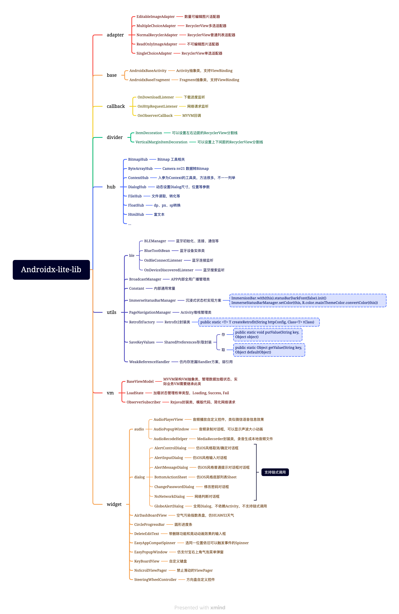

# Androidx-lite-lib

Android依赖库，Android-library升级兼容到Androidx

## 使用说明

### 引入方式
#### 最新版本: [](https://jitpack.io/#AndroidCoderPeng/Androidx-lite-lib)


1、在项目的build.gradle里面添加如下代码块：

``` gradle
allprojects {
    repositories {
        maven { url 'http://maven.aliyun.com/nexus/content/groups/public/' }
        //依赖库
        maven { url 'https://jitpack.io' }
        google()
    }
}
```

2、在APP的build.gradle中添加如下代码块：

``` gradle
dependencies {
    implementation fileTree(include: ['*.jar'], dir: 'libs')
    //基础依赖库
    implementation 'com.github.AndroidCoderPeng:Androidx-lite-lib:latest.integration'
}
```

3、最后点击Sync同步一下就可以用了，例如要跳转页面，一行代码解决：
``` java
ContextHub.navigatePageTo(context, BluetoothActivity.class);
```

又或者要使用对话框
``` java
new AlertControlDialog.Builder()
    .setContext(this)
    .setTitle("这里是标题")
    .setMessage("这里是对话框内容")
    .setNegativeButton("取消")
    .setPositiveButton("确定")
    .setOnDialogButtonClickListener(new AlertControlDialog.OnDialogButtonClickListener() {
        @Override
        public void onConfirmClick() {

        }

        @Override
        public void onCancelClick() {

        }
    }).build().show();
```

其他的就不一一列举了，有用得到的可以自己试试~~~

详细功能架构图如下所示：

